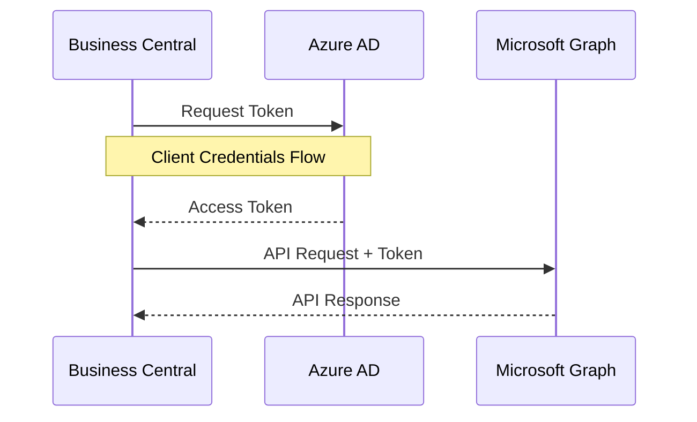
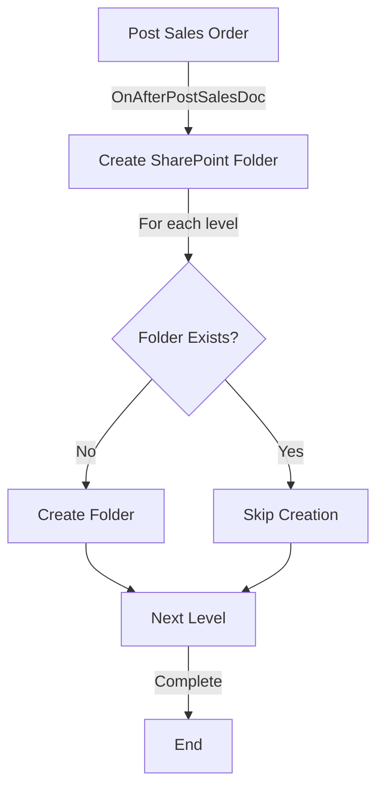
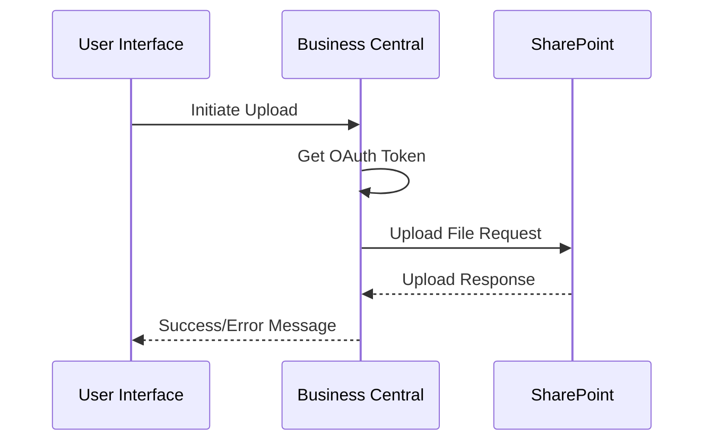
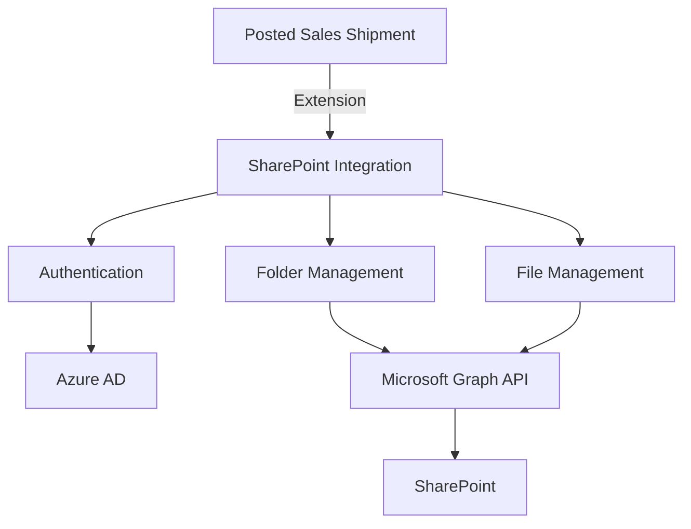

# SharePoint Integration for Business Central

This extension enables automatic SharePoint folder creation and file management for Posted Sales Shipments in Business Central.

## Features

- Automatic folder creation in SharePoint when posting sales shipments
- File upload/download capabilities
- Factbox integration in Posted Sales Shipment page
- Azure AD authentication
- Hierarchical folder structure (Year/Month/ShipmentNo)

## Setup Requirements

1. Azure AD App Registration with following settings:
   - Application (Client) ID
   - Client Secret
   - Directory (Tenant) ID
   - Required API Permissions:
     - Microsoft Graph
       - Files.ReadWrite.All
       - Sites.ReadWrite.All

2. SharePoint site configuration:
   - SharePoint Site ID
   - SharePoint Drive ID
   - Base folder path (default: "Delivery Images")

## Process Flows

### Authentication Flow


### Sales Shipment Posting Flow


### File Upload Process


## Installation

1. Import the extension to Business Central
2. Configure SharePoint Setup page with:
   - Azure AD credentials
   - SharePoint configuration
   - Enable the integration
3. Test the connection using the "Test Connection" action

## Configuration

Navigate to SharePoint Setup page and configure:

```al
table 50200 "SharePoint Setup"
{
    fields
    {
        field(1; "Primary Key"; Code[10])
        field(2; "Client ID"; Text[250])
        field(3; "Client Secret"; Text[250])
        field(4; "Tenant ID"; Text[250])
        field(5; "SharePoint Site ID"; Text[250])
        field(6; "SharePoint Drive ID"; Text[250])
        field(7; "Base Folder Path"; Text[250])
        field(8; "Enabled"; Boolean)
    }
}
```

## Architecture



## Error Handling

The extension includes comprehensive error handling for:
- Authentication failures
- Network issues
- Permission problems
- SharePoint API limitations

## Security

- Uses OAuth 2.0 for secure authentication
- Credentials stored securely in Business Central
- Minimal permission scope requirements
- No user credentials stored

## Dependencies

- Business Central 2023 Wave 1 or later
- Azure AD subscription
- SharePoint Online subscription

## License

This code is licensed under the MIT License.